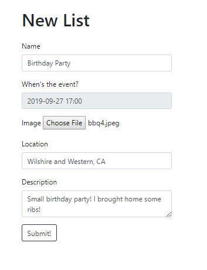
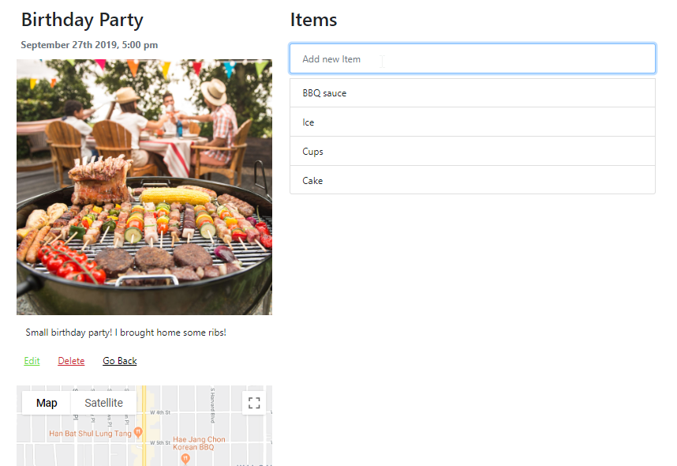
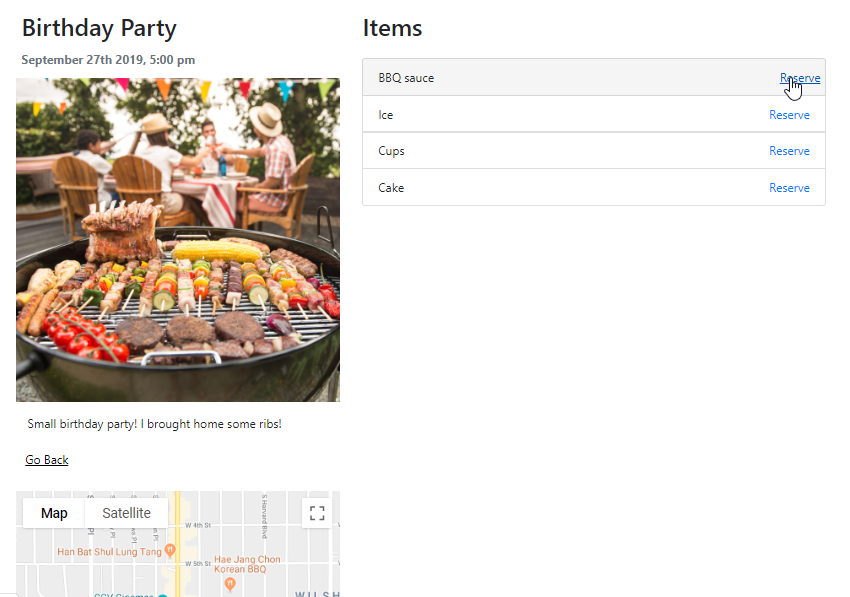
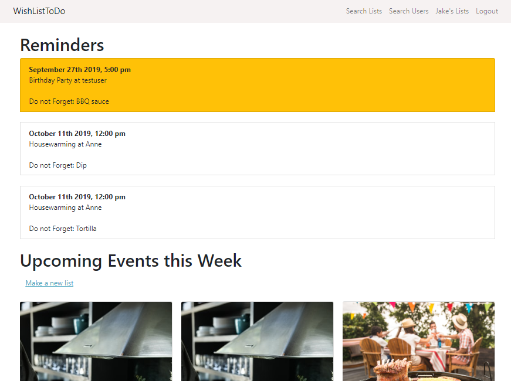
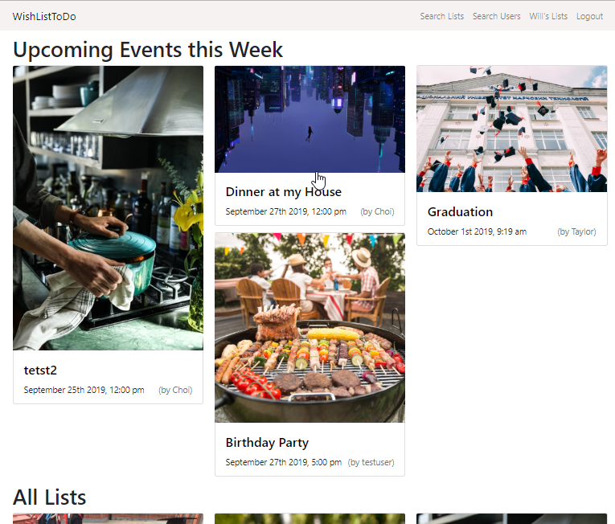
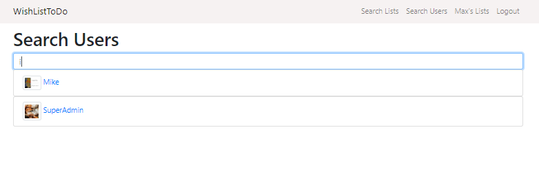
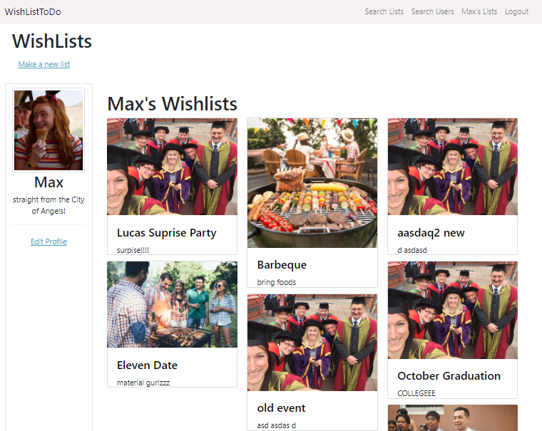

# wishlisttodo
One of my pet project that allows you to create list of items, and once the list is done other users can 'reserve' an item. 

## Tech Used
This project uses **MongoDB**, **ExpressJS** and **NodeJS** for back-end, and **Bootstrap** for front-end. I also used **Google API** for displaying location in a map, and **Cloudinary** to store the images.

## How the Application Works
A use case is when there's an event (e.g. Birthday Party). A user can create a list and consider that an event. That event will have relevant information such as the time, place, and description.

<kbd>
  
</kbd>

Once this event/list is done, you can put items that you might need for the event (e.g. Cups, Ice, Dip). 

<kbd>
  
</kbd>

As a user, I can search for that event/list and reserve an item in that event.

<kbd>
  
</kbd>

All reserved items will appear in the user's home page. Items corresponding to an event/list that's happening in a week will be marked orange to alert the user.

<kbd>
  
</kbd>

When an event/list has already passed, its items will be deleted and the user cannot toggle the said list anymore.

### Other Useful Features

- As a user, you can search for lists -- Upcoming events within the week will be in front, and they are sorted by date.

<kbd>
  
</kbd>

- You can also search users in the application.

<kbd>
  
</kbd>

- You can see your profile where you can see all your lists, and you can edit information about yourself.

<kbd>
  
</kbd>

- Items reserved are sorted by date.
- You must be logged in to create a list and search for users and lists.
- You cannot edit and delete lists that are not yours, unless you are a SuperAdmin.
